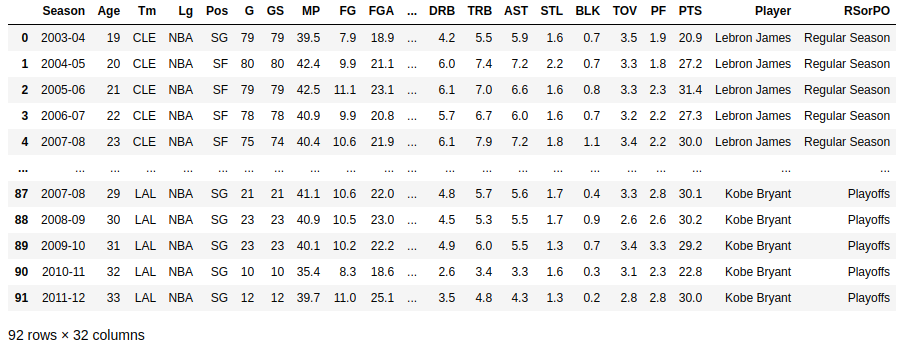
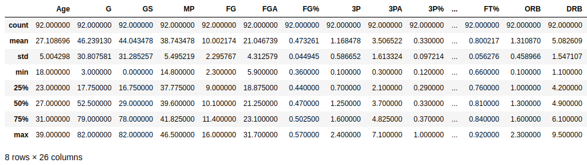
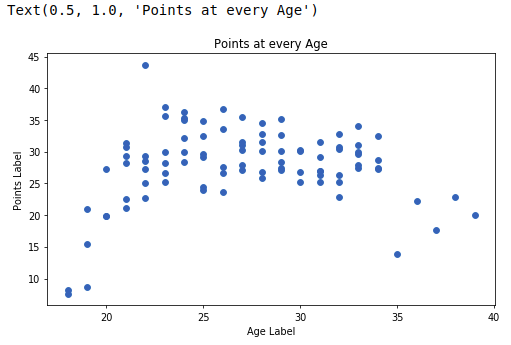
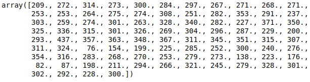
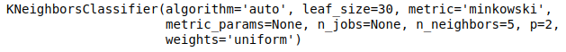
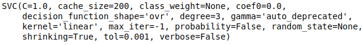
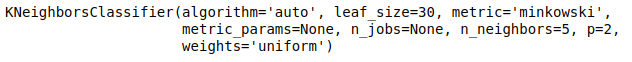
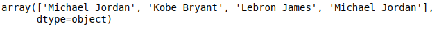
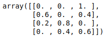

As a fun and cool mini project for my Data Mining course, I found a data set of these three great basketball players stats.Then I used machine learning algorithms such as KNN, Logistic Regression and SVM via Python, Pandas and scikit-learn and finally did following tasks:
Mixing MJ, KB and LJ stats, finding average stats and finally predict their performance by age.(I used KNN and SVM)
Find the player’s name by giving age and performance(average points). (I used Logistic Regression)

Let's get into it deeper

# Dataset

I found a dataset about Michael Jordan, Kobe Bryant and Lebran James games stats from [Kaggle.com](https://www.kaggle.com/xvivancos/michael-jordan-kobe-bryant-and-lebron-james-stats).
There are a few files in there, in which **per_games_stats.csv** is used in this article!

Basically, it's needed to import three libraries for our work; **pandas**, **numpy** and **matplotlib**(we need **pyplot** from it).

    import pandas as pd
    import numpy as np
    import matplotlib.pyplot as plt

**Let's load the file(per_games_stats.csv)**

    data = pd.read_csv('per_game_stats.csv')
    df = pd.DataFrame(data)
    df

Now Let's get some statistical infromation about it:

    df.describe()

Now, what shall we do?

Our goal is to kind of merge these great palyers into one player(kind of GOAT), and get stats from that big one like what is the average points per game from the combined player.

Before that, let's fetch **age** and **pts** from our dataset

    age = df[df.columns[1]]
    pts = df[df.columns[29]]

Now we transfer this data into a scatter plot

    figure = plt.figure(figsize= (8, 4.5),dpi = 70)
    axes = figure.add_axes([0.1, 0.1, 0.8, 0.8])
    axes.scatter(age, pts)
    axes.set_xlabel('Age Label')
    axes.set_ylabel('Points Label')
    axes.set_title('Points at every Age')

As we've fetched our data, we need to combine this data into 1-player's stats. **KNN**(k-nearest neighbors algorithm) is quite a good choice for the purpose.

We imort it from sklearn.neighbors and define a classifier for it.

    from sklearn.neighbors import KNeighborsClassifier
    classifier = KNeighborsClassifier(n_neighbors= 5)

In order to fit the classifier using .fit() method, need two parameters, which in my case they are **age** and **points**. Firstly, it s needed to make both of them into arrays which I use **numpy ndArray**, age must be transfered into a 2D array via ***reshape*** command, and as points in our table are in **float** format, I want to make them into integer type.

    age = np.array(age)
    type(age)

>numpy.ndarray

    pts = np.array(pts)
    type(pts)

>numpy.ndarray

    age = np.reshape(age, (-1, 1))

**Note**:
 
For making fit model work, I needed to make pts 10 times bigger, otherwise I will reach 'continues type' Error!

    pts.astype(int)
    pts = pts * 10
    pts

Finally, we have to **fit** our classifier:

    classifier.fit(age, pts)

So, we did fit the classifier. now what???

Our next step, is to test what we have made by few examples

### E.G 1

>I want to check out, if our great player is at age 26, how many points can he make per game?

    print('At age 26 they made', classifier.predict([[26]])/10, ' points per match!')

Our answer:

>At age 26 they made [23.7]  points per match!

Interesting ;)

Let's make another one:

### E.G 2

>I want to check out, if our great player is at age 23, how many points can he make per game?

    print('At age 24 they made', classifier.predict([[24]])/10, ' points per match!')

Answer:
>At age 24 they made [28.4]  points per match!

# SVM

We can reach our goal using another algorithm called SVM(**Select Vector Machine**).
Our approach is quite like the previous one:

Importing the algorithm

    from sklearn import svm

Using a **Linear Kernel** classifier

    clf = svm.SVC(kernel= 'linear')

Now, fitting the model:

    clf.fit(age, pts)

Testing our data :

    test_data = [[37], [20], [24], [27], [30], [34]]
    print('Points they made : ', clf.predict(test_data)/10)

Answer:

>Points they made :  [17.6 27.2 30.  27.1 30.1 27.4]

# Logestic Regression

It's another algorithm, besides **KNN** and **SVM** we can use. But how? For what purposes?
Let me make one.

>If we have un classified stats about a player, who might it be? Michael, Kobe or Lebron?

For this purposes, to find out answers and classifications with probabilities(uncertain), **Logestic Regression** could be used.
 
So we import it

    from sklearn.linear_model import LogisticRegression

Make a classifier out of it:

    calssifier = LogisticRegression()

I want to give **.fit()** method, their **Age** and **Points**, and I want to recieve **Player Name** as the prediction. This is how I fit the model :

    classifier.fit(df[['Age', 'PTS']], df['Player'])

Here is my sample data by viewing to the table at the beginings of this article:

age 23, 40 points is **defiinetly** Michael Jordan

age 37, 17 points is **definetly** Kobe Bryant

age 32, 34 points **might** be Lebron James

We can now check out, how accurate is our classifier!
So we test it:

    testData = [[23, 40], [37 ,17], [24, 30], [32, 34]]
    classifier.predict(testData)

But there is always a parameter of probability, let s check that :

    classifier.predict_proba(testData)

In above probability the list order is like this :

Columns indicate each player, and rows show accuracy about each of 4 data we feed into classifier.

For example, second column indicates that for our data(second one which was [37, 17]), goal player might be Michael Jordan with probability of 60%, Kobe Bryan with 0% chance, and finally Lebron James might be for 40% of chance!!

Quite fun info might be fetched out of this classifier!
