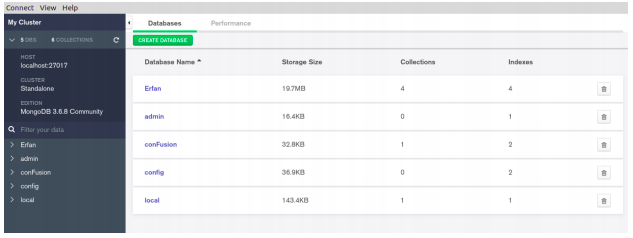

  This is a brief instruction to ‘How to install **MongoDB** on Linux, how to work with it, and finally,
how to have some queries on it’. Note that my operating system is **Ubuntu 19.04** (package manager is
***apt-get*** !).
 
 
  There are two approaches to our purpose. One is the **Command-Line**(terminal) way and the
other one is using **MongoDB Compass** (GUI tool). We will cover both ways in this paper.

## A- Command-Line(terminal) approach :

### Step 1: Import the MongoDB repository

It`s needed to add the MongoDB repository to our package-manager(apt-get) for the purpose of
downloading

> sudo apt-key adv --keyserver hkp://keyserver.ubuntu.com:80 --recv 7F0CEB1

Then create a source list file for MongoDB

> echo "deb http://repo.mongodb.org/apt/ubuntu xenial/mongodb-org/3.4 multiverse" | sudo tee /etc/apt/sources.list.d/mongodb-org-3.4.list

Next job is to update the local package repository

> sudo apt-get update

### Step 2: Install the  MongoDB packages
Install the latest stable version of MongoDB:

> sudo apt-get install -y mongodb-org

### Step 3: Launch MongoDB as a service on Ubuntu 16.04

We need to create a unit file, which tells **systemd** how to manage a resource. Most common unit type, service, determine how to **start** or **stop** the service, **auto-start** etc.

Create a configuration file named mongodb.service in /etc/systemd/system to manage the MongoDB service.

> sudo vim /etc/systemd/system/mongodb.service

**Note**: You could use **“nano"** app instead of **“vim”** above!

Copy the following contents in the file.

Update the systemd service with the command stated below:
> systemctl daemon-reload

Start the service with **systemcl**.
> sudo systemctl start mongodb

**Note**: The commands of **stop** and **restart** can be done in the same way above!

## B- MongoDB Compass(GUI tool) approach :

Referenced to [MongoDB](https://www.mongodb.com/), you can get the app via this [page](https://docs.mongodb.com/compass/master/install/). A **.deb** file would be downloaded, then you may install it with the given commands :

Then press **enter** and the app will be installed soon!
The installation section finished! So we could run the MongoDB with >mongo command in our terminal,
or also run it from MongoDB Compass application.No

**Now** let`s see how does it work:

First Open MongoDB app via ***>mongo*** command .
 

***>show dbs*** command will show you the databases on your system
For using a specific database you can easily type ***>use DB_NAME*** (note that if the DB_NAME you`ve
entered is not valid, it would create a new database with your given name(DB_NAME)).
 
You have seen in SQL we had tables, but there is no such thing in MongoDB.instead, we have
**collections** that can be defined as “an amount of data in .json format”. Via the ***>show collections***
command you can view the collections in your database. Although if you want to create a new
collection you can easily enter the below command :

From now on, we are going to see some commands and especially queries on MongoDB .
 Before everything starts, an amount of data (called dataset) is needed. I downloaded my dataset ([New York City Airbnb Open Data](https://www.kaggle.com/dgomonov/new-york-city-airbnb-open-data)) from [Kaggle](https://www.kaggle.com/).  The format of your downloaded file would be **.CSV** . What you will download would be something like this :

It looks like a big table. But the thing about MongoDB is that it only works with **.JSON** format.JSON stands for JavaScript Object Notation which is something like this :

We put this format into the category of Key-Value data.

Previously we saw MongoDB just works with **JSON** format, but here`s the good news: MongoDB can get **.csv** files and automatically change it to **JSON** format. Here we will see another big step: **How to import .csv files(datasets) to MongoDB ?**
We will cover this part with both Command-Line and GUI way.

# GUI approach:

Open MongoDB Compass app. Set a new connection with the hostname of localhost and the default port of 27017. Afterward, you will see a page like down below :

This page shows you the whole of your databases created by MongoDB. Then you should create a
database of your own by which you can find the option with + sign at the bottom of the page like this
screenshot :

You will face this form after you click on the + bottom. I called my database name
**newDatabase** and then I created a collection with the name of **NYAirbnb**.

You will face this Scene after clicking on the CREATE DATABASE bottom; A new database with a
collection created with your given name.

Our next step is to import the dataset(.csv file). For that purpose, you just need to click on the
collection bottom above the window and then click on the import bottom. Finally, you will face this
window and by importing the file, we will be so close to the end.

You can easily see that after importing .csv file, it will generate the dataset to JSON format.

# Command-Line approach:

Run your terminal app. Use the following command style :

> mongoimport -d mydb -c mycollection --type csv --file locations.csv --headerline

**mongoimport**: it`s the app which imports the dataset to the database

**-d**: is the database

**mydb**: you can enter your database name for importing dataset 

**-c**: is the collection

**mycollection**: it will be the name of collection that your dataset is going to be placed at

**--type csv**: is the format of the dataset in which can be **CSV** or **JSON**

**--file**: is the file

**location.csv**: would be the name of your data set

After having an understanding of what these commands mean, here`s the exact command style I just
used :

    mongoimport -d newDatabase -c newCollection --type csv --file AB_NYC_2019.csv --headerline

Well, well. We`ve just finished our importing section. Here we come to the Query section.

# Query:

First thing to do, is to see the data stored on our collection. Do as below :

    db.COLLECTION_NAME.find()

In my case you can see :

You can see there`s a big messy data down here. So, in order to make it prettier, you just need
to use **.pretty()** as you will see :

To find a specific document in our database here`s how we can do the query :

    db.mycol.find({KEY : VALUE}).pretty() 

If you want to use via **and** operator :

    db.mycol.find(
    {
        $and: [
           {key1: value1}, {key2:value2}
        ]
      }
    ).pretty()  

Otherwise, if you want to use **or** operator :

    db . mycol . find (
        {
              $or : [
             { key1 : value1 }, { key2 : value2 }
              ]
          }
        ). pretty () 

Here we go to some examples from our database :

 
 Let`s get all the Airbnb hosts who service rooms from “Manhattan” :

 

 What if I don`t want to see the hosts’ ’ whole data?? I can use the projection by the way you will see :

 I can add the keys to view by adding them into another block and by setting them to 1 which means
‘show them’!

     {“name” : 1, “host_name” : 1, “neighbourhood_group” : 1, “price” : 1, “minimum_nights” : 1}

Now I want to see the hosts whose houses are in Manhattan and the price of their possession is less
than $100, but before that let`s note that we can use the comparison operators via these commands :

**NOTE**: You should use the operators via $ sign!

**Equality**

    {<key>:<value>}

**Less Than**

    {<key>:{$lt:<value>}}

**Less Than Equals** 

    {<key>:{$lte:<value>}}

**Greater Than** 

    {<key>:{$gt:<value>}}

**Greater Than Equals**

    {<key>:{$gte:<value>}}

**Not Equals**

    {<key>:{$ne:<value>}}

Here`s the example for less than: 

## Update a document:

In order to update your documents in MongoDB, follow this instruction:

    db.COLLECTION_NAME.save({_id:ObjectId(),NEW_DATA}) 

See the example that I want to change: I want to change name of _id:5da5c6736082f11678a11b4e from
Elisabeth to Alex, see what will happen:
Command:

    db.newCollection.update({"_id" :
    ObjectId("5da5c6736082f11678a11b4e ")} ,{$set: {"host_name" : 
    "Alex"}})

Finally, if you want to delete your collection, database or, document you can use these commands :

**Delete Document**: 

    db.COLLECTION_NAME.remove(DELLETION_CRITTERIA)

**Drop Collection**: 

    db.COLLECTION_NAME.drop()

**Drop Database**:

Switch to the wanted database before you delete it! 

    db.dropDatabase() 

Gathered and edited by Mohammad Vakilzadeh
 
github.com/randkill

With references to :

https://www.kaggle.com/
 
https://www.tutorialspoint.com/mongodb/index.htm
 
https://docs.mongodb.com/compass/master/install/
 
https://hevodata.com/blog/install-mongodb-on-ubuntu/
 
https://www.digitalocean.com/community/tutorials/how-to-install-mongodb-on-ubuntu-18-04
 
https://docs.mongodb.com/manual/tutorial/install-mongodb-on-ubuntu/
