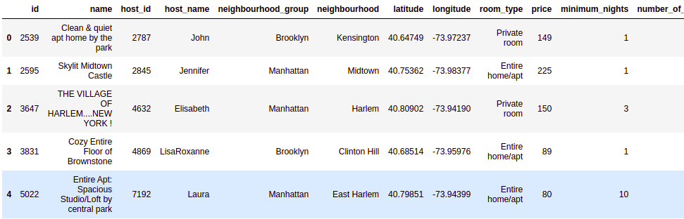
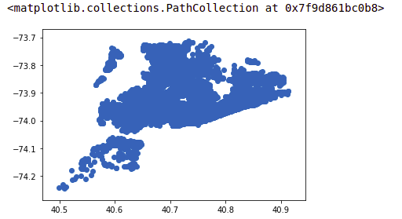
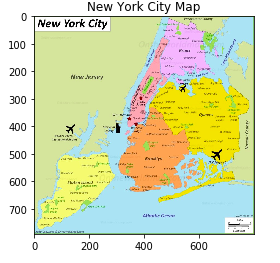
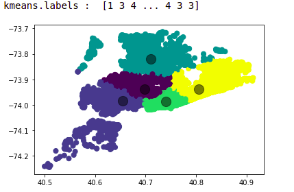
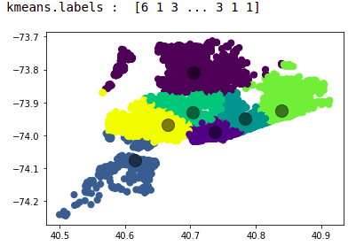
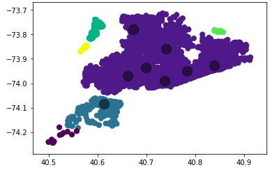

Hey there, today I'm gonna make a liitle example of clustering algorithms. For this purpose, I found a New York City Airbnb dataset from [kaggle.com](https://www.kaggle.com/dgomonov/new-york-city-airbnb-open-data). 
Also it was not accurate that much, I brought it down here. It's worth mentioning that it was an Exercise of my Data Mining course.
Let's look more deeper to the dataset:

First by importing libraries and then loading **.CSV** file:
```python
import pandas as pd
import matplotlib.pyplot as plt
import numpy as np

data = pd.read_csv("AB_NYC_2019.csv")
df = pd.DataFrame(data)
df.head()
```
<div style="text-align:center">

</div>

As you can see we have latitue and longitutde, so, what can we do is to fetch that data, put it on a scatter plot and what we get? Of course, the New York city map :)

Let's do it:

```python
latitude = np.array(df["latitude"])
longitude = np.array(df["longitude"])
print('Latitude: \n', latitude, '\nlongitude: \n', longitude)
```

>Latitude: 
 [40.64749 40.75362 40.80902 ... 40.81475 40.75751 40.76404] 
longitude: 
 [-73.97237 -73.98377 -73.9419  ... -73.94867 -73.99112 -73.98933]

```python
plt.scatter(latitude, longitude)
```

<div style="text-align:center">

</div>

It's quite a map, let's compare it to real NY map:

<div style="text-align:center">

</div>

They quite look the same with few differences.

As you can see in the real map, neighbourhood are indicated, what I'm gonna do, is to use clustering algorithms to see whether we could show neighbourhoods properly or not.

Initially, I would use **KMeans** fro clustering. Now we should import it :
```python
from sklearn.cluster import KMeans
```

In order to use KMeans algorithm we need to use a 2*n matrix, here I want to combine the latitude and longitude from 2 one dimension array to a 2*1 dimension array
```python
combined = np.vstack((latitude, longitude)).T
combined
```

>array([[ 40.64749, -73.97237],
       [ 40.75362, -73.98377],
       [ 40.80902, -73.9419 ],
       ...,
       [ 40.81475, -73.94867],
       [ 40.75751, -73.99112],
       [ 40.76404, -73.98933]])

```python
combined.shape
```

>(48895, 2)


Here I give the KMeans the parameter of n_clusters and then fit the algorithm and see the results on a scatter
```python
kmeans = KMeans(n_clusters=5)
kmeans.fit(combined)

print("kmeans.labels : ", kmeans.labels_)

answer_Kmeans = kmeans.predict(combined)

plt.scatter(combined[:, 0], combined[:, 1], c=answer_Kmeans, s=50, cmap='viridis')

centers = kmeans.cluster_centers_
plt.scatter(centers[:, 0], centers[:, 1], c='black', s=200, alpha=0.5)
plt.show()
```

<div style="text-align:center">

</div>

As you see in the real map, there are 5 main neighbourhoods, that's why I assigned the parameter of **n_cluter** to 5. But, there's a problem, the southern island is considered a unique neighbourhood itself. A big contrast!!. What we might do, is to change parameters, in which I assigned the number of clusters to 7 this time :
```python
kmeans = KMeans(n_clusters=7)
kmeans.fit(combined)

print("kmeans.labels : ", kmeans.labels_)

answer_Kmeans = kmeans.predict(combined)

plt.scatter(combined[:, 0], combined[:, 1], c=answer_Kmeans, s=50, cmap='viridis')

centers = kmeans.cluster_centers_
plt.scatter(centers[:, 0], centers[:, 1], c='black', s=200, alpha=0.5)
plt.show()
```

<div style="text-align:center">

</div>


As it's obvious, we sortly fixed the southern island but it's not that much accurate to the real world.

Let's try another algorithm called **DBScan**, and see if it's accurate or not.

```python
from sklearn.cluster import DBSCAN
clustering = DBSCAN(eps=0.025, min_samples=12).fit(combined)
DBSCAN_answer = clustering.fit_predict(combined)

plt.scatter(combined[:, 0], combined[:, 1], c=DBSCAN_answer, s=50, cmap='viridis')

centers = kmeans.cluster_centers_
plt.scatter(centers[:, 0], centers[:, 1], c='black', s=200, alpha=0.5)
plt.show()
```


<div style="text-align:center">

</div>

Uuuum
<br>
At least **Kmeans** was better in our case. I guess finding neighbourhoods based clustering might not be a proper approach. Please infrom me via my [email](erfan.vh@gmail.com) if you found a good solution.

Thanks for reading.
