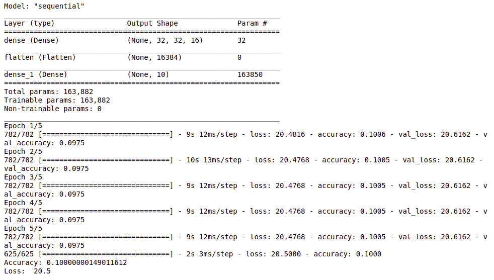
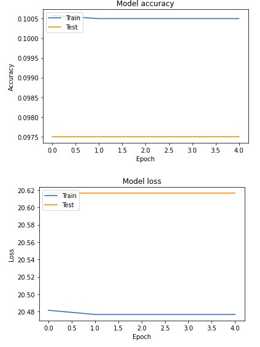
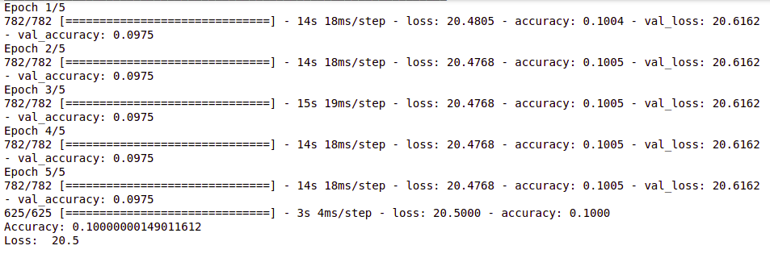
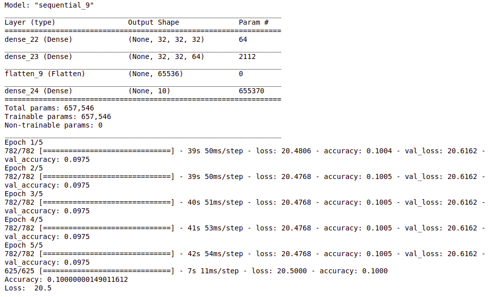
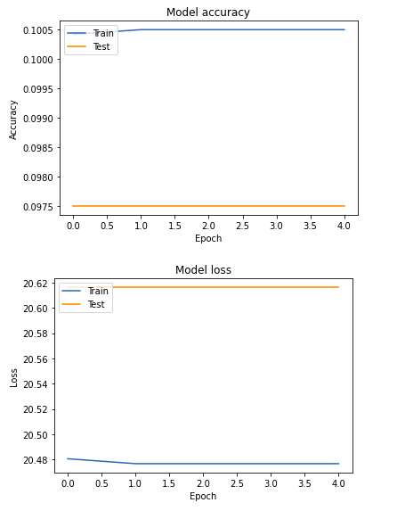
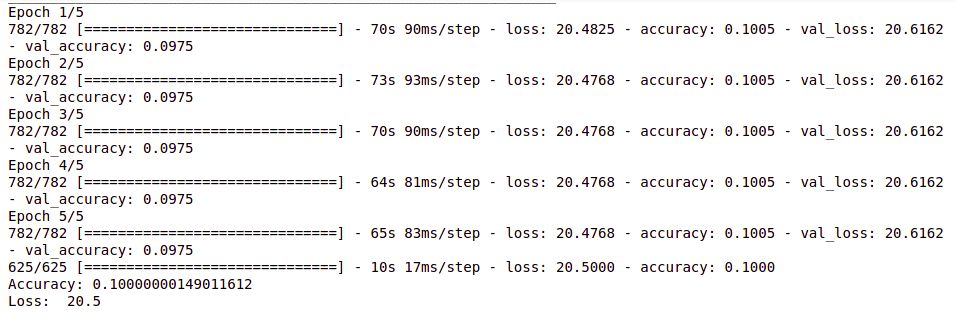
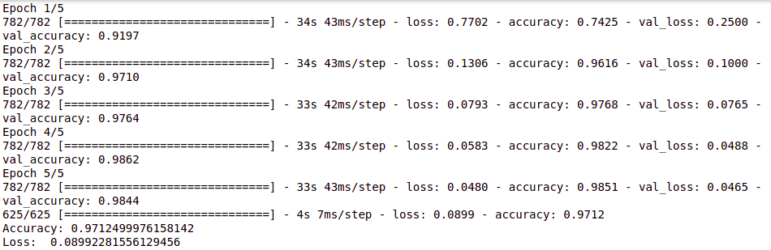
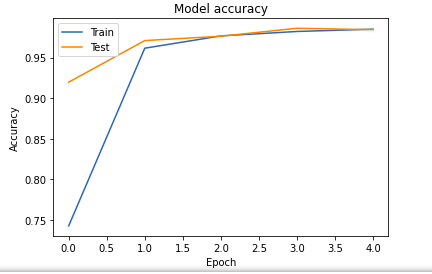
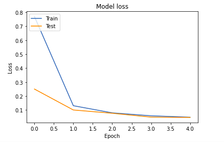

During my second time of working with image classifiers in course Computational Intelligence, I had a chance to design and develop a recognizer for a persian handwritten digit dataset(a persian alternative to mnist dataset). Then, I compared the accuracy of CNN with a multi layer perceptron and answers once again showed how good convolutionals can be in this field.

So let's get deeper:

Actually this **semi-mnist** dataset was given from a [github repository](https://github.com/amir-saniyan/HodaDatasetReader) and [insturcions to read the files](https://github.com/amir-saniyan/HodaDatasetReader/blob/master/HodaDatasetReader.py) where given there.

It's needed to load the dataset. Note that, images are 32*32. We need two kinds o data, train and test. By each of them, their images and labels must be indicated.

## Step 1 : Loading the dataset

```python
train_images, train_labels = read_hoda_dataset(dataset_path='Train.cdb',
                                images_height=32,
                                images_width=32,
                                one_hot=False,
                                reshape=True)
test_images, test_labels = read_hoda_dataset(dataset_path='Test.cdb',
                                images_height=32,
                                images_width=32,
                                one_hot=False,
                                reshape=True)
```

## Step 2 : Preprocessing

In prepration for using our read data in upcoming Neural Network, the DataSet must be preprocessed to be usable at our NN.

### Importing needed libraries
```python
from tensorflow.keras import models, layers
from tensorflow.keras.utils import to_categorical
from tensorflow.keras.optimizers import SGD
import matplotlib.pyplot as plt
import numpy as np
```


Here we can see the lenght of **train_images** and size of each element.
```python
train_images.shape
```

>(60000, 1024)


32 * 32 = 1024

So each image is saved into a linear array, row by row. But, this fromat is not functional and efficient. Thus, it's needed to convert them to **32*32 shape**.

**Note**: As you know, each pixel of an image, is considered a number in [0 , 255]. For more comfortable calculation, we devide each pixel by 255 as below:

```python
train_images = train_images.reshape((60000, 32, 32, 1))
train_images= train_images.astype('float32') / 255 
test_images = test_images.reshape((20000, 32, 32, 1))
test_images= test_images.astype('float32') / 255
```

In order to prevent **overfitting**, a group of training dataset called **validation** was defined. In our case, we consider them 10000 images of training data from its last.
```python
validation_images = train_images[50000:]
validation_labels = train_labels[50000:]

train_images = train_images[:50000]
train_labels = train_labels[:50000]
```

## Step 3 : Building the Nueral Network Model

In this article, we use **Tensorflow**.
```python
from tensorflow.keras import backend
```

For experiment, I will design **1Layer and 2Layer perceptron neural network** and finally you will see the differences with the **convoluional NN**.


### 1 Layer Perceptron


```python
def OneLayerNN(learningRate, layer1Neurons, layer2Neurons, epoch, batchSize):
  #declaring a sequential model which is a stack of layers
  model = models.Sequential()

  #adding first hidden layer with given number of neurons and  
  #considering input_shape as the input layer in shape of (28, 28, 1)
  #and also SIGMOID activation function
  model.add(layers.Dense(layer1Neurons , activation = 'sigmoid', input_shape = (32, 32, 1)))
  
  #this FLATTEN would help us to make the shape of our network flatted to make it easier
  # to connect it to last output layer with 10 neurons
  model.add(layers.Flatten())
  #output layer of 10 neurons
  model.add(layers.Dense(10, activation = 'sigmoid'))
  #defining STOCHASTIC GRADIENT DESCENT with given learning rate
  sgd = SGD(lr=learningRate)
  #compiling the model with STOCHASTIC GRADIENT DESCENT optimizer and MSE(mean_squared_error)
  #loss function. Also the comparison metric we are using, is accuracy
  model.compile(optimizer = sgd , loss='mean_squared_error', metrics=['accuracy'])
  #let`s summarize the model and see what we have designed
  model.summary()
  #fitting the model with given training and validation data and also epochs and batch size
  fittedModel = model.fit(train_images, train_labels, validation_data = (validation_images, validation_labels),epochs=epoch, batch_size=batchSize)

  #after fitting the model and training it, it`s time to check how will it
  #answer to the test data(which is the EVALUATION section)
  test_loss, test_acc = model.evaluate(test_images, test_labels)
  print('Accuracy:', test_acc)
  print('Loss: ', test_loss)

  # Plot training & validation accuracy values
  plt.plot(fittedModel.history['accuracy'])
  plt.plot(fittedModel.history['val_accuracy'])
  plt.title('Model accuracy')
  plt.ylabel('Accuracy')
  plt.xlabel('Epoch')
  plt.legend(['Train', 'Test'], loc='upper left')
  plt.show()

  # Plot training & validation loss values
  plt.plot(fittedModel.history['loss'])
  plt.plot(fittedModel.history['val_loss'])
  plt.title('Model loss')
  plt.ylabel('Loss')
  plt.xlabel('Epoch')
  plt.legend(['Train', 'Test'], loc='upper left')
  plt.show() 
```

```python
OneLayerNN(0.5, 16, 16, 5, 64)
```

<div style="text-align:center">

</div>

<div style="text-align:center">

</div>

What if we increase the number of neurons??

```python
OneLayerNN(0.5, 32, 64, 5, 64)
```
<div style="text-align:center">

</div>

As you see, 1 Layer perpetron is way weak for Image Procesing purposes, Let's check out the 2 Layer perceptron:

### 2 Layer Perceptron

```python
def TwoLayerNN(learningRate, layer1Neurons, layer2Neurons, epoch, batchSize):
  #declaring a sequential model which is a stack of layers
  model = models.Sequential()

  #adding first hidden layer with given number of neurons and  
  #considering input_shape as the input layer in shape of (28, 28, 1)
  #and also SIGMOID activation function
  model.add(layers.Dense(layer1Neurons , activation = 'sigmoid', input_shape = (32, 32, 1)))
  #adding second hidden layer with given numbers of neurons and SIGMOID activation function
  model.add(layers.Dense(layer2Neurons, activation = 'sigmoid'))
  #this FLATTEN would help us to make the shape of our network flatted to make it easier
  # to connect it to last output layer with 10 neurons
  model.add(layers.Flatten())
  #output layer of 10 neurons
  model.add(layers.Dense(10, activation = 'sigmoid'))
  #defining STOCHASTIC GRADIENT DESCENT with given learning rate
  sgd = SGD(lr=learningRate)
  #compiling the model with STOCHASTIC GRADIENT DESCENT optimizer and MSE(mean_squared_error)
  #loss function. Also the comparison metric we are using, is accuracy
  model.compile(optimizer = sgd , loss='mean_squared_error', metrics=['accuracy'])
  #let`s summarize the model and see what we have designed
  model.summary()
  #fitting the model with given training and validation data and also epochs and batch size
  fittedModel = model.fit(train_images, train_labels, validation_data = (validation_images, validation_labels),epochs=epoch, batch_size=batchSize)

  #after fitting the model and training it, it`s time to check how will it
  #answer to the test data(which is the EVALUATION section)
  test_loss, test_acc = model.evaluate(test_images, test_labels)
  print('Accuracy:', test_acc)
  print('Loss: ', test_loss)

  # Plot training & validation accuracy values
  plt.plot(fittedModel.history['accuracy'])
  plt.plot(fittedModel.history['val_accuracy'])
  plt.title('Model accuracy')
  plt.ylabel('Accuracy')
  plt.xlabel('Epoch')
  plt.legend(['Train', 'Test'], loc='upper left')
  plt.show()

  # Plot training & validation loss values
  plt.plot(fittedModel.history['loss'])
  plt.plot(fittedModel.history['val_loss'])
  plt.title('Model loss')
  plt.ylabel('Loss')
  plt.xlabel('Epoch')
  plt.legend(['Train', 'Test'], loc='upper left')
  plt.show()
```
```python
TwoLayerNN(0.5, 32, 64, 5, 64)
```

<div style="text-align:center">

</div>

<div style="text-align:center">

</div>

```python
TwoLayerNN(0.25, 64, 64, 5, 64)
```

<div style="text-align:center">

</div>


As it is obvious, there is so much **Loss** and terribly low **Accuracy**.

Even with 4 Layer Perceptron, in which you can design by your own, **Accuracy** wouldn't change, only **Loss** improves from 20 to 2.

Finally **CNN**s are here for **Image** purposes.
Let's make one:

### Convoloutional Neural Network

```python
conv_train_images = train_images
conv_train_labels = train_labels
conv_test_images = test_images
conv_test_labels = test_labels
conv_validation_images = validation_images
conv_validation_labels = validation_labels

conv_train_labels = to_categorical(conv_train_labels)
conv_validation_labels = to_categorical(conv_validation_labels)
conv_test_labels = to_categorical(conv_test_labels)

def Conv():
    model = models.Sequential()
    model.add(layers.Conv2D(32, (3, 3), activation='relu', input_shape=(32, 32, 1)))
    model.add(layers.MaxPooling2D((2, 2)))
    model.add(layers.Conv2D(64, (3, 3), activation='relu'))
    model.add(layers.MaxPooling2D((2, 2)))
    model.add(layers.Conv2D(64, (3, 3), activation='relu'))
    model.add(layers.Flatten())
    model.add(layers.Dense(64, activation='relu'))
    model.add(layers.Dense(10, activation='softmax'))

    model.compile(optimizer='rmsprop', loss='categorical_crossentropy', metrics=['accuracy'])
    fittedModel = model.fit(conv_train_images, conv_train_labels, epochs=5, batch_size=64, validation_data=(conv_validation_images, conv_validation_labels))
    #after fitting the model and training it, it`s time to check how will it
    #answer to the test data(which is the EVALUATION section)
    test_loss, test_acc = model.evaluate(conv_test_images, conv_test_labels)
    print('Accuracy:', test_acc)
    print('Loss: ', test_loss)

    # Plot training & validation accuracy values
    plt.plot(fittedModel.history['accuracy'])
    plt.plot(fittedModel.history['val_accuracy'])
    plt.title('Model accuracy')
    plt.ylabel('Accuracy')
    plt.xlabel('Epoch')
    plt.legend(['Train', 'Test'], loc='upper left')
    plt.show()

    # Plot training & validation loss values
    plt.plot(fittedModel.history['loss'])
    plt.plot(fittedModel.history['val_loss'])
    plt.title('Model loss')
    plt.ylabel('Loss')
    plt.xlabel('Epoch')
    plt.legend(['Train', 'Test'], loc='upper left')
    plt.show()
```
and results:

```python
Conv()
```

<div style="text-align:center">

</div>

<div style="text-align:center">

</div>

<div style="text-align:center">

</div>


As it's visible, we reached the outstanding **Accuracy** of **97.12%** with too little **Loss** of **4.65** via a very simple and easy to design **CNN**. Therefore, we showed by exmperiment that **CNN**s are perfect for image purposes compared to other Neural Networks.

I hope you've enjoyed my experiment
